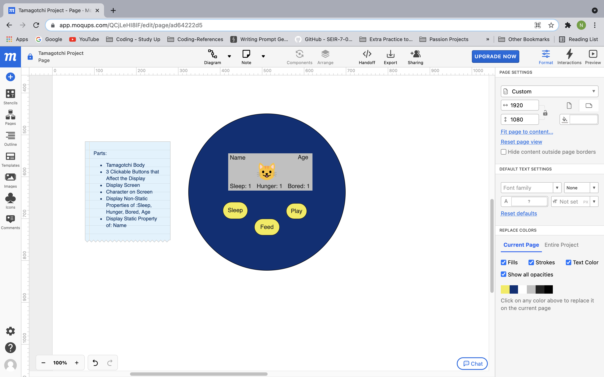

# Scope
The final product will be a Sailor Moon themed Tamagotchi game that the player is able to interact with via clickable buttons. The Tamagotchi will have states of hunger, boredom, and sleepiness that go up at set interval rates. If any of those states reach 10 the Tamagotchi dies. The player is able to stave off death by choosing the best button that corresponds to either feeding, putting to sleep, or playing with the pet.

# Technologies Used
* VS Code
* Moqups
* HTML
* Javascript
* CSS

# Wireframes

# User Stories

## Who is the user?
The user is the **Player**, who wants to have fun with their Tamagotchi pet.

### The Player Can...
* Customize their Tamagotchi by giving it a name when the screen loads
* Get insight into their pet's mood via the mascot translator
* Hover over certain page elements for fun animation surprises
* Click the start button to get the game started
* See their pet's name, age, and current status of hunger, sleepiness, and boredom displayed
* Receive notifications when their pet has a birthday and watch their age change
* Watch their pet's stats increase based on different set intervals
* Click buttons to interact with their pet:
    *Feed Button - reduces hunger
    *Sleep Button - reduces sleepiness
    *Play Button - reduces boredom
* Use the buttons to decrease their pet's rising stats
* View images that correspond with different actions their pet is doing
* Receive a game over message and option to play again once their pet dies
* Stats cannot be decreased once the tamagotchi dies
* Can unlock a "hidden" ending that definitively wins the game

# Instructions 
1. Start the game, by clicking the start button.
2. Keep the boredom, sleepiness, and hunger stats from reaching ten.
3. Press the play, feed, or sleep buttons to decrease the corresponding rising stats. 
4. Follow the link to get started: https://nndeto.github.io/tamagotchi-game/

# Triumphs
Coding out an ending that allows the player to win if it hits a threshold of twenty. That way the game isn't one continual thing of trying to decrease stats.
Creating dynamic messages that represent the moods of the Tamagotchi and are expressed via a speech bubble and Tamagotchi mascot translator.

# Challenges
I was unable to solve the problem of making my design responsive and allowing my game to look just as good on smaller screens. I experimented with different ratios and sizes but was only ever capable of making parts of the game look good.

